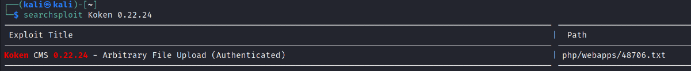
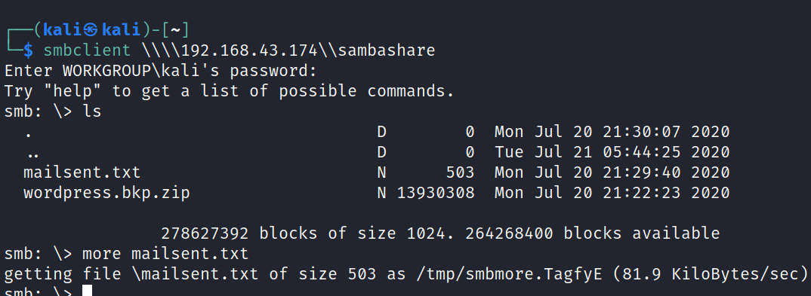
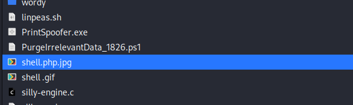

# Photographer
22 June 2022
08:33 PM

for conformation

rename the file name

<https://www.exploit-db.com/exploits/48706>
then forward

user\_password\_here

select * from users;

nothing interseting found same passwd babygirl

