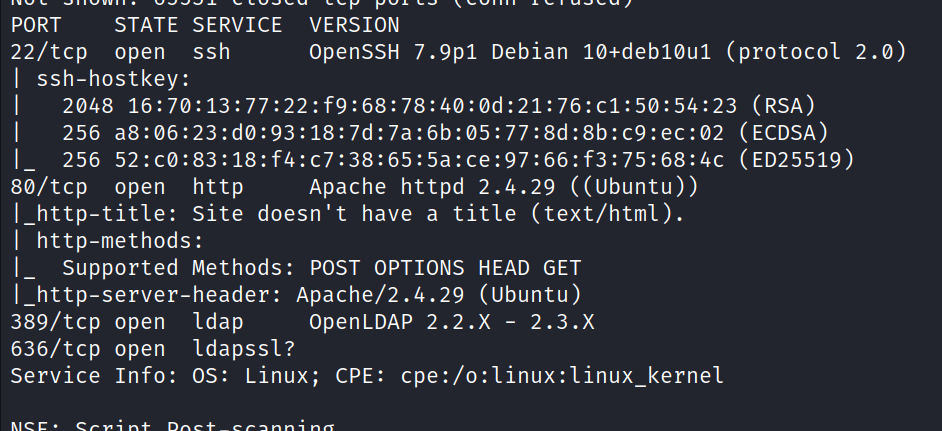
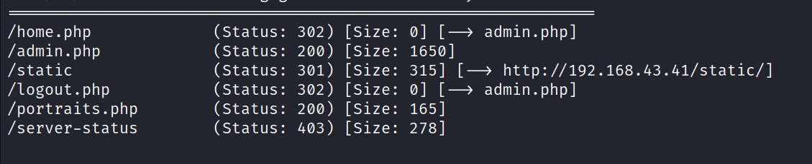
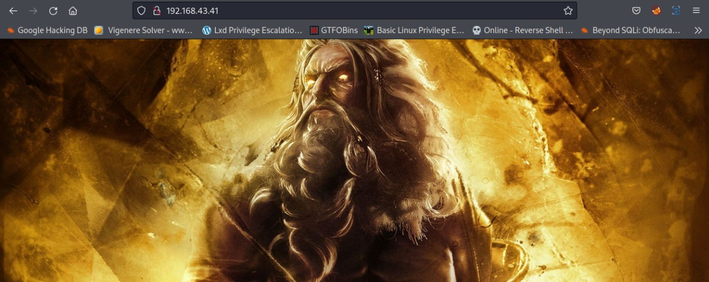
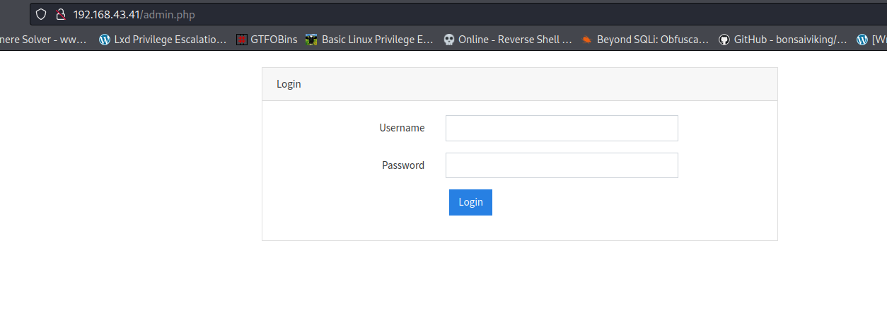
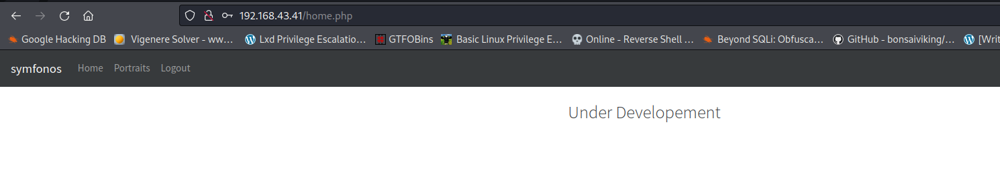
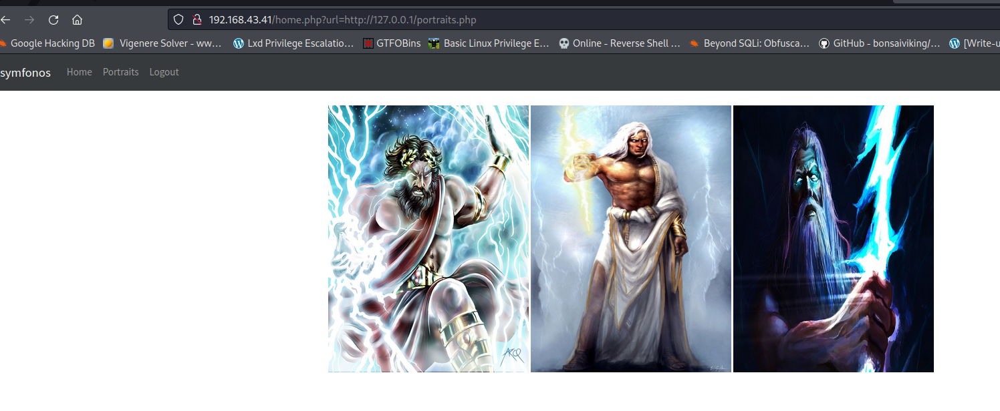
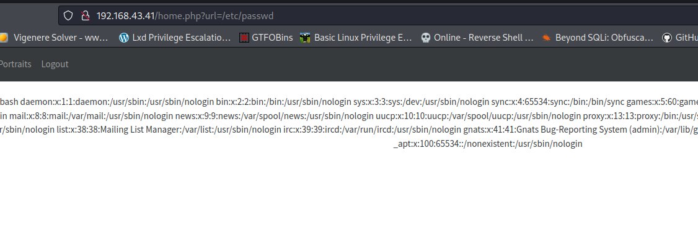
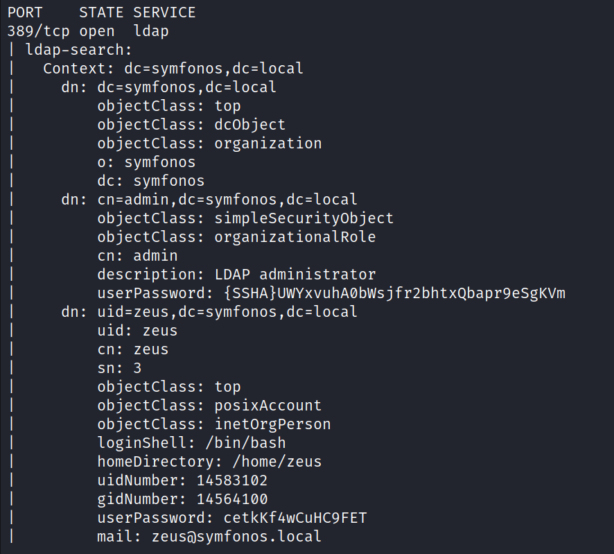
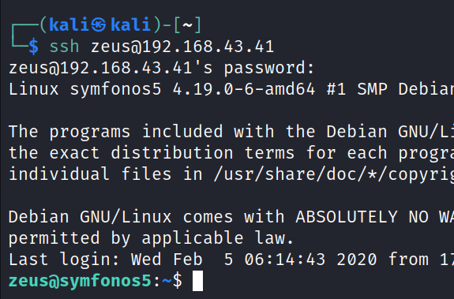
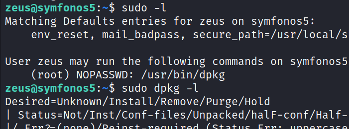

# Symfonos-5
21 June 2022
12:19 PM

 
 and in username and pass

nmap 192.168.0.112 -p 389 --script ldap-search --script-args 'ldap.username="cn=admin,dc=symfonos,dc=local", ldap.password="qMDdyZh3cT6eeAWD"'

