# Symfonos-1
14 June 2022
11:44 PM

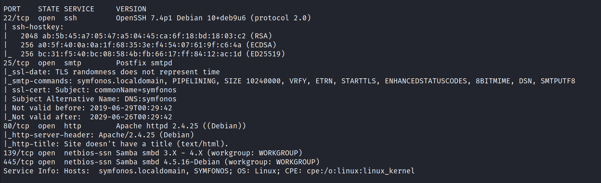

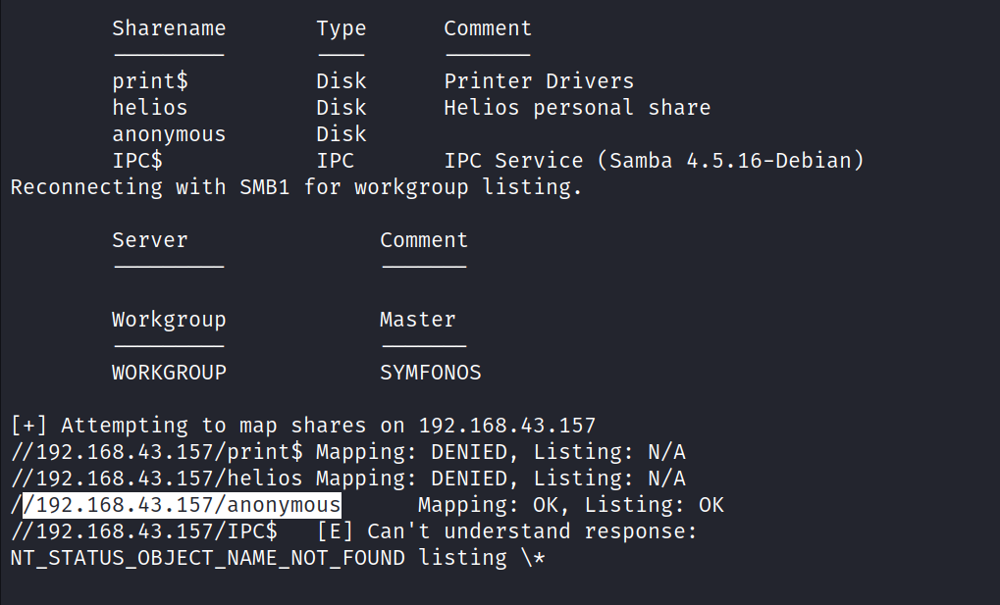

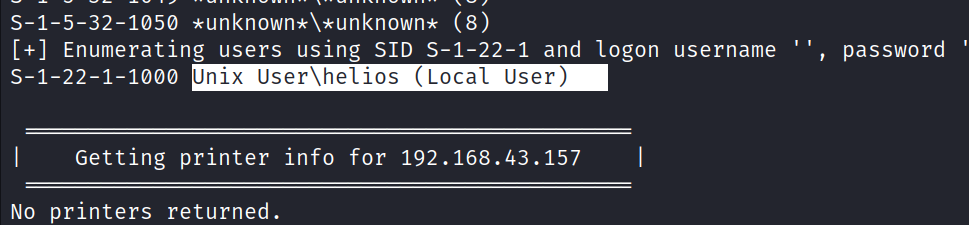

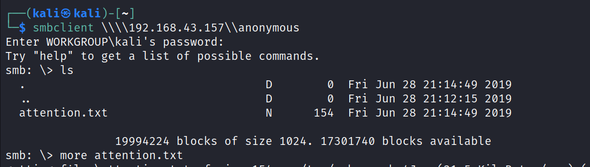

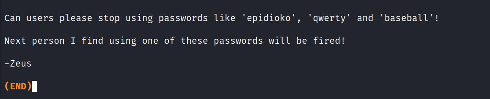

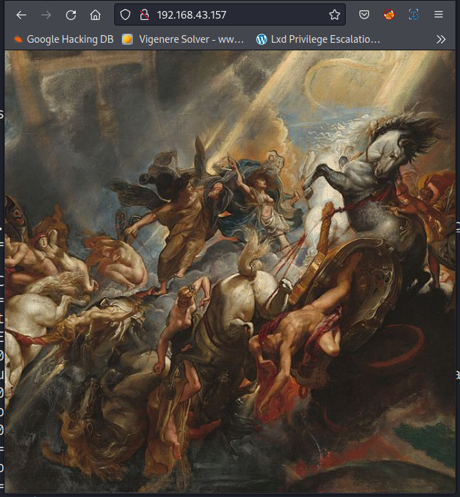

epidioko', 'qwerty' and 'baseball'

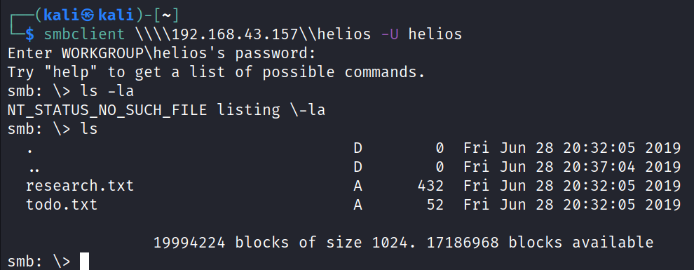

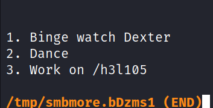

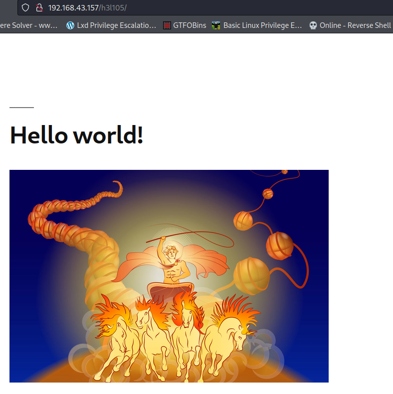

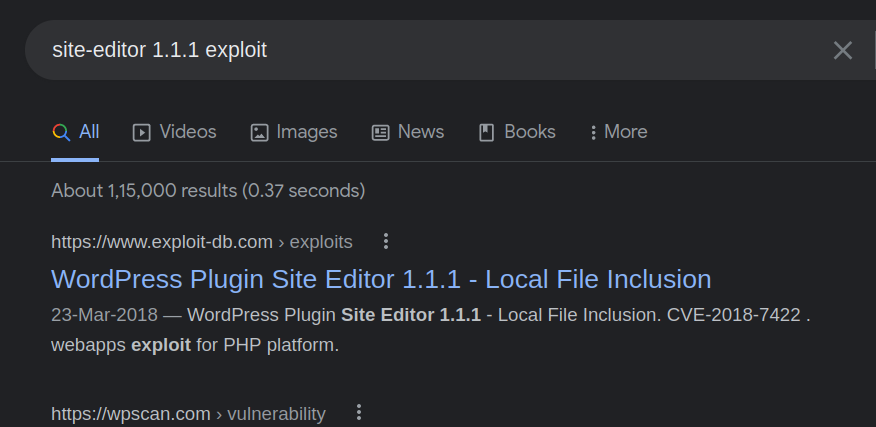

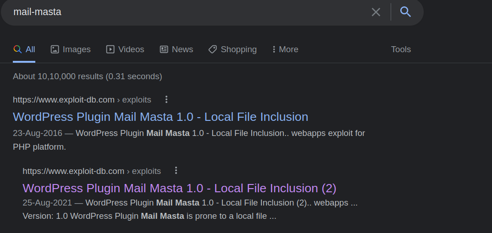

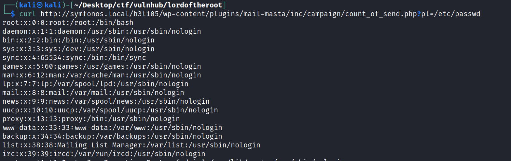

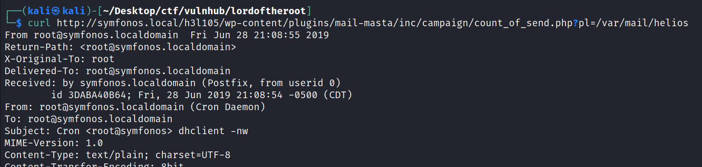

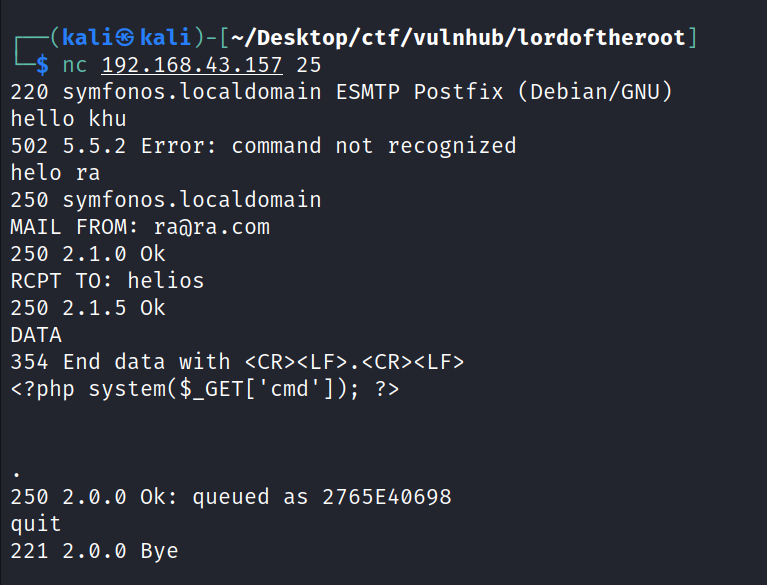

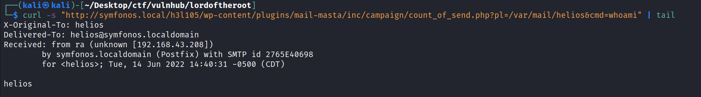

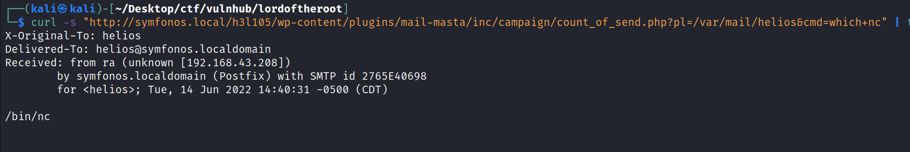

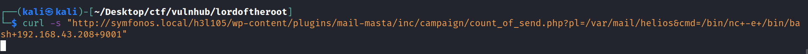

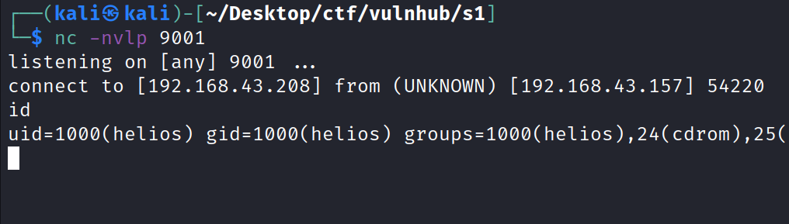

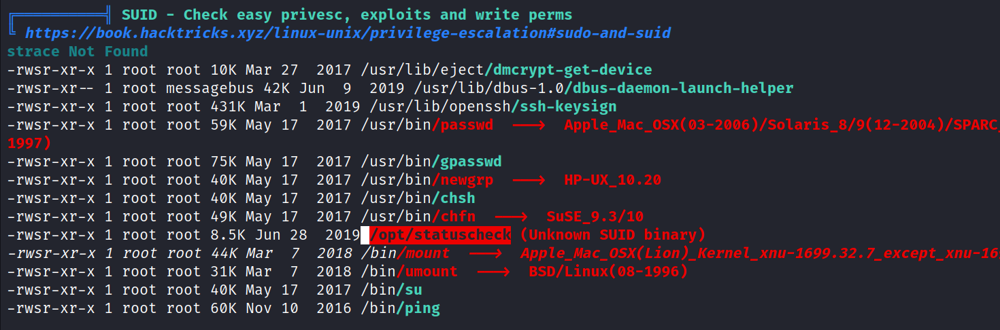

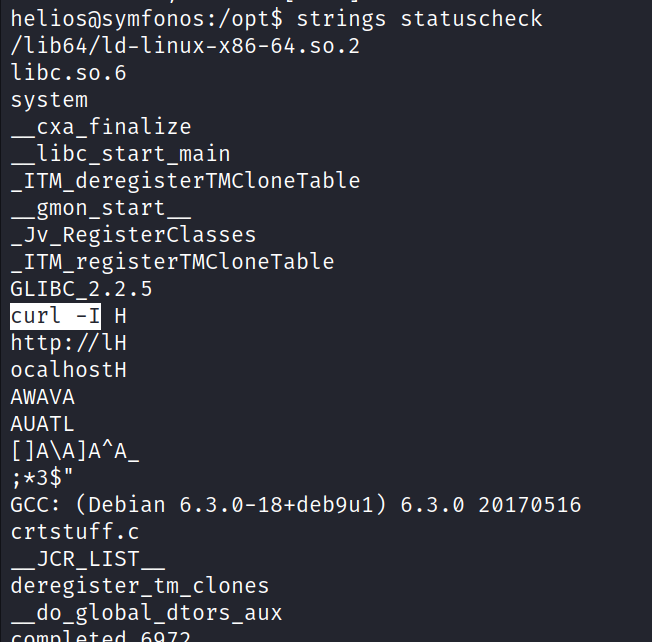

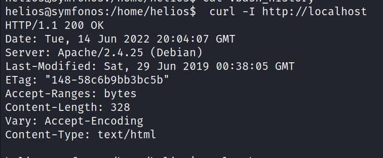

Since the path to curl isn’t hard-coded, I can easily create my own curl file, manipulate the PATH variable so it shows up first, then call /opt/statuscheck again and I should be able to execute my own curl program as root. I’ll just use a very simple shell script to open a new shell for me as root:
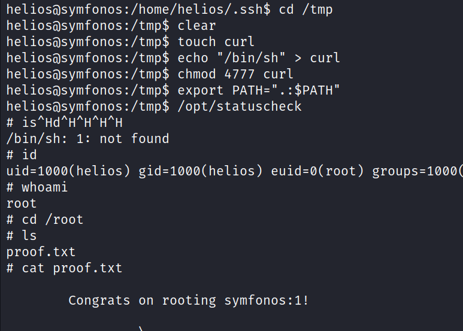
