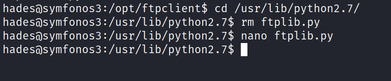

# Symfonos-3
16 June 2022
11:02 AM

shellshock vulnerability

after that wait some time to recieve the packet and press ctrl+c
tranfer to the main machine and analysi
the file.pcap

we get the password now log into the user

we can see ftpclient.py has root privilege

so i change the ftplib file from python that was import

The only interesting thing we know about the system is that there’s file called ftpclient.py in /opt/ftpclient/ running as root, we saw that in pspy output. And it connects with ftp using ftplib.py. If we can edit that(ftplib.py)imported file we can get a root reverse shell through that.**

But first we should see if we have permission to edit python libraries or not.

Now just wait for sometime(or run some random commands to speed up the process) and we’ll have the root reverse shell

