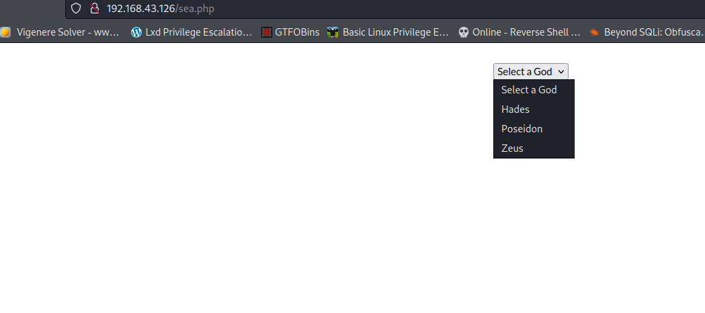
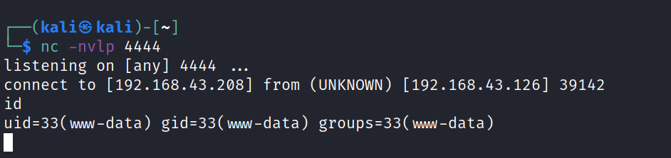

# Symfonos-4
17 June 2022
11:19 AM

trying to read /etc/passwd but didn't succed so try to read log files

after seeing this try to view log files

using socat for port forwading
socat TCP-LISTEN:5689,fork,reuseaddr tcp:127.0.0.1:8080 &
or
socat TCP-LISTEN:5689,fork,reuseaddr tcp:127.0.0.1:8080

