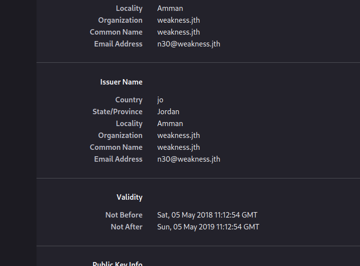
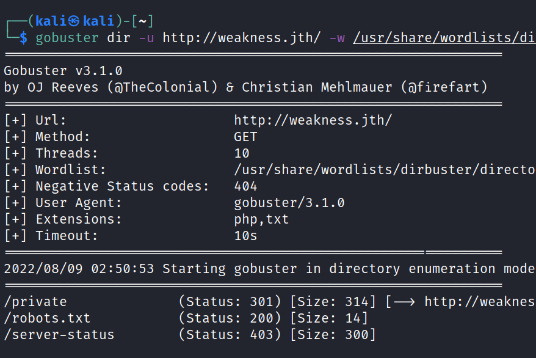
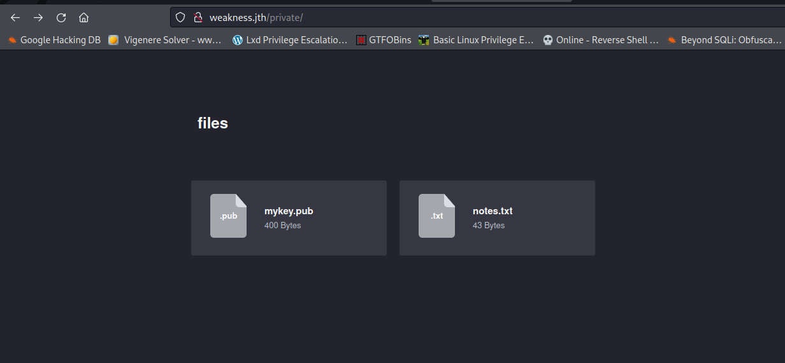
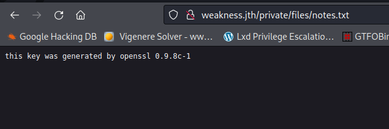
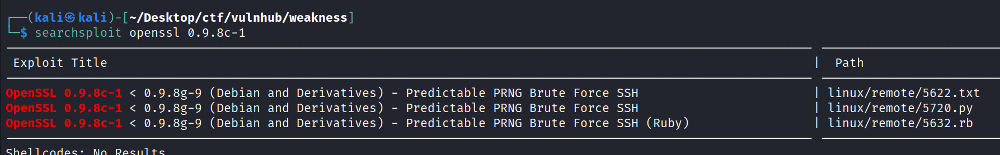
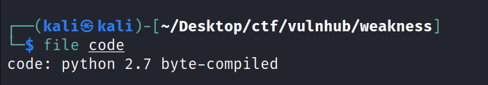
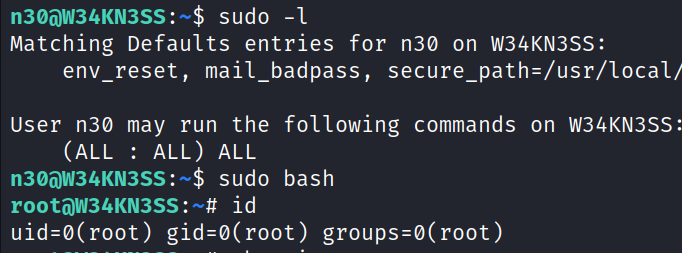

# Weakness
09 August 2022
12:21 PM

\#tar -xvf 5622.tar.bz2
cat mykey.pub

mv code code.pyc
code is complied python code
we have to decompile it to see the actual code
by using online decomplier

we can clearly see the password
dMASDNB!!#B!#!#33

